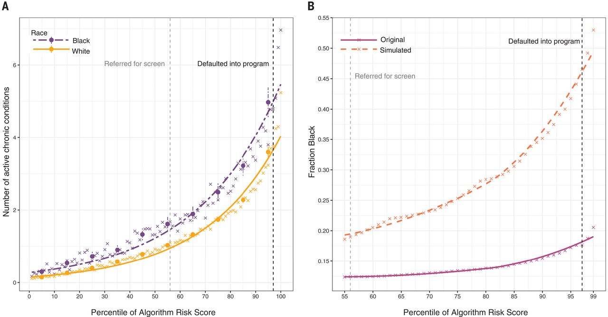
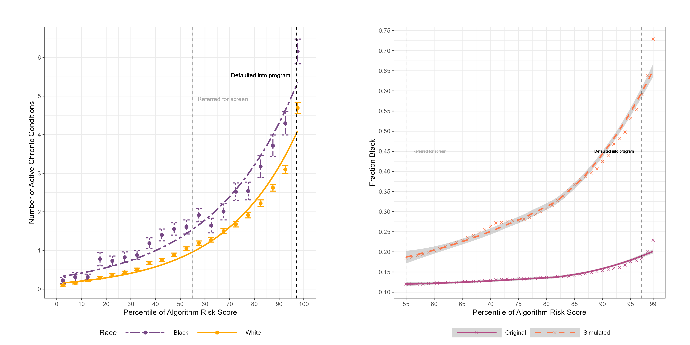
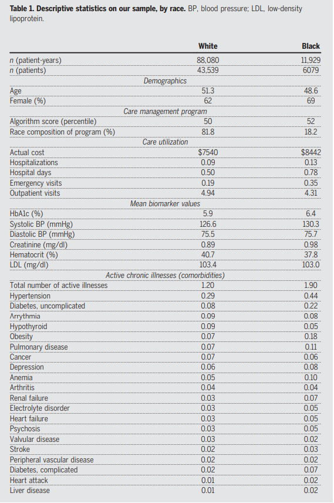

## **Introduction**

In recent years, the integration of algorithms into healthcare systems has revolutionized the management of patient populations.
These algorithms are designed to predict healthcare needs, enabling health systems to allocate resources efficiently and improve patient outcomes.
However, the reliance on automated decision-making tools raises critical concerns about fairness and equity, particularly regarding potential biases that may inadvertently disadvantage certain demographic groups.
The research article "Dissecting racial bias in an algorithm used to manage the health of populations" by Obermeyer et al. addresses this pressing issue by examining racial disparities embedded within a widely utilized health risk prediction algorithm.

This final paper builds upon the midterm analysis by delving deeper into the methodologies employed in Obermeyer et al.'s study and exploring the normative concerns arising from their findings.
A significant focus of this analysis is on the key figures presented in the original paper, which the authors use to substantiate their claims about inequality manifested within the data.
By scrutinizing these figures, the paper aims to assess whether the methods used by Obermeyer et al. to create figures that support their claims are sufficient.
Furthermore, it evaluates if the figures are robust enough to justify claims with significant societal impact and proposes potential improvements to figures to illustrate the dataset's content better.

## **Summary of the Paper’s Method**

Obermeyer et al. investigate the presence of racial bias in a commercial risk prediction algorithm used by health systems to identify patients with complex health needs.
The algorithm, which estimates future healthcare costs based on historical insurance claims data, is intended to allocate resources to high-risk patients through care management programs.
In this context, a care management program is a coordinated system providing more in-depth and personalized healthcare. 
The study utilizes a comprehensive dataset from a large academic hospital comprising 6079 Black patients and 43,539 White patients, observed over 11,929 and 88,080 patient-years, where a patient-year represents data collected for an individual patient in a calendar year.

**The Algorithm**

The authors do not disclose the name of the algorithm used to obtain risk scores for the data associated with a patient.
They claim that it is a widely used commercial tool that is employed on a large scale[1]

### **Data Collection and Preparation**

The researchers obtained algorithmic risk scores for each patient year based on claims data from the preceding year.
The dataset included demographic information, insurance type, diagnosis and procedure codes, medications, and detailed cost data.
**Race was excluded from the algorithm's input features to prevent direct racial discrimination.**

### **Identifying Racial Disparities**

To assess the algorithm's calibration across races, the researchers compared the predicted risk scores with actual health outcomes and healthcare costs.
Health outcomes were measured using a comorbidity score derived from electronic health records, while healthcare costs were obtained from insurance claims data.

The authors found that, at identical risk scores, Black patients exhibited significantly higher illness burdens than White patients.
For example, at the 97th percentile of risk scores, Black patients had an average of 4.8 chronic conditions compared to 3.8 in White patients.
This disparity suggests that the algorithm underestimates the health needs of Black patients relative to their risk scores.

### **Mechanisms of Bias**

Obermeyer et al. explored potential mechanisms underlying the observed bias, identifying that the algorithm's reliance on predicted healthcare costs inadvertently introduced racial bias.
Despite similar risk scores, Black patients generated lower healthcare costs than White patients due to systemic barriers to accessing care.
This discrepancy indicates that the algorithm's proxy for health needs—future costs—fails to account for unequal access and utilization of health services among different racial groups.

To quantify the impact of this bias, the authors conducted counterfactual simulations where the algorithm was adjusted to eliminate the predictive gap between Black and White patients.
These simulations demonstrated that rectifying the bias could substantially increase the proportion of Black patients receiving additional care management support, from 17.7% to 46.5% at the highest risk threshold.

## Data Transparency

A significant limitation of Obermeyer et al.'s study is the lack of transparency surrounding the proprietary algorithm used to generate risk scores.
Since the algorithm is neither explicitly named nor its internal workings disclosed, seeking replicating the study's findings becomes difficult.
This opacity hinders independent verification of the results and prevents other researchers from conducting similar analyses to confirm or challenge the identified racial biases.
Without access to the algorithm's source code or detailed methodology, the study's conclusions rely solely on the authors' representations, which may inadvertently introduce additional biases or overlook critical factors influencing the outcomes.
Furthermore, claims regarding counterfactual simulations that seek to remedy the biases present in the original algorithm become less convincing as it can not be verified if such bias was present in the first place.

## **Analysis of the Validity of Figures**

### Importance of Validating Figures

Like any other, this paper relies heavily on the validity of its figures to support its claims and demonstrates that observed disparities are statistically significant.
Figures illustrate key findings, such as the relationship between risk scores and health outcomes across racial groups, and show the difference between racial groups.
Validating the correctness of these figures is necessary to ensure that the conclusions drawn are based on accurate and reliable data representations.
I focus on analyzing three of the most critical figures used by the paper to make its claims:

Figure 1a: Depicts the number of active chronic conditions by race, conditional on algorithm risk score.

Figure 1b: Shows the fraction of Black patients at each percentile of the algorithm risk score before and after simulation adjustments.

Table 1: Descriptive statistics on sample data, such as demographics and mean biomarker values.

### Examination and Improvement of Figure 1a and Figure 1b

Figure 1a/b Original.\
**A**) Mean number of chronic conditions by race, plotted against algorithm risk score.
(**B**) Fraction of Black patients at or above a given risk score for the original algorithm (“original”) and for a simulated scenario that removes algorithmic bias (“simulated”: at each threshold of risk, defined at a given percentile on the *x* axis, healthier Whites above the threshold are replaced with less healthy Blacks below the threshold, until the marginal patient is equally healthy).
The × symbols show risk percentiles by race; circles show risk deciles with 95% confidence intervals clustered by patient.
The dashed vertical lines show the auto-identification threshold (the black line, which denotes the 97th percentile) and the screening threshold (the gray line, which denotes the 55th percentile).[1]

\
Figure 1 Improved.
**A)** Confidence intervals have been added at every percentile to enhance the frequency and visibility of the intervals.
**B)** An error was identified in the code generating Figure 1b, specifically in the procedure for swapping healthier White patients in the fast-track group with sicker Black patients not in the fast-track group during the counter factual simulation.
This was addressed and fixed.

### Analysis of Figure 1 

The authors of the original paper utilized Figure 1 effectively to illustrate the core finding that the algorithm underestimates the health needs of Black patients compared to White patients at similar risk scores.
By visually depicting the disparities in active chronic conditions (Figure 1a) and the representation of Black patients in different risk percentiles (Figure 1b), the figures serve as compelling evidence of racial bias embedded within the algorithm.
The authors excelled in several aspects of their presentation.
They provided a clear visualization of disparities, with the figures successfully highlighting the key differences between Black and White patients, making complex statistical information easily understandable.
One small improvement to 1a is that in the original version, while the confidence intervals are present, it is difficult to discern a clear separation that shows independence.
By clearly visualizing the CI’s in the improved versions, the author's claim that there is a difference in the burden of proof needed for Black patients to be enrolled in the fast-track program is clearer. 
(Fast-track is another term used by the authors to refer to patients enrolled in the specialized care program).

### Data Change Needed for Figure 1b

An error was identified in the author’s code generating Figure 1b, specifically in the procedure for swapping healthier White patients in the fast-track group with sicker Black patients not in the fast-track group during the counterfactual simulation.
This was first mentioned by Sam Corbett-Davies in 2022, 3 years after the paper was initially published. 
The original code removes the healthiest fast-tracked White patient from the simulated counterfactual fast-track table if they are healthier than a non-fast-tracked Black patient.
Due to this error, the figure originally showed that 47% of the fast-tracked patients would be Black after correcting the bias, whereas the correct figure should be 59%.

This error is significant because it under represents the extent of the algorithm's bias and its impact on Black patients.
Correcting this error is crucial to accurately reflect the true disparity and support the paper's claims about the severity of the bias.

### **Accuracy of Statements Made Citing Figure 1**

The statements made in the paper that cite Figure 1 are generally accurate in highlighting the racial disparities caused by the algorithm.
However, due to the error in Figure 1b, any statements regarding the specific proportion of Black patients in the counterfactual fast-track group are understated.
One such claim is the following, “Figure 1b demonstrates that correcting the bias in the algorithm would increase the proportion of Black patients receiving additional care management support, highlighting the potential for mitigating disparities through algorithmic adjustments.” With the error in Figure 1b corrected, the second statement becomes even more compelling, as the increase in the proportion of Black patients is greater than initially reported.

### **Examination and Improvement of Table 1**

{width="273"}

Table 1.
Descriptive statistics on our sample, by race.
BP, blood pressure; LDL, low-density
lipoprotein[1]

Table 1 effectively presents a comprehensive comparison of patient characteristics between Black and White patients, highlighting key disparities in demographics, care utilization, biomarker levels, and the prevalence of chronic illnesses.
The authors did well in organizing the data into clear and distinct categories, making complex statistical information accessible to a broad audience.
From an ethical standpoint, the validity of Table 1 is crucial because it underpins the arguments regarding bias in the healthcare algorithm.
While the table presents a wealth of information, it lacks measures of statistical significance or variability, such as standard deviations or confidence intervals.
Without these statistical indicators, it is difficult to fully assess the reliability of the differences reported between the two groups.

To improve Table 1, including statistical measures such as p-values or confidence intervals would enhance the ability to interpret the significance of the observed differences between racial groups.
Adding these measures would allow readers to determine whether the disparities are statistically significant or could be attributed to random variation.
Additionally, as a reviewer with limited experience in processing and understanding biomarker data, providing units of measurement and indicating clinical reference ranges would offer context for the clinical relevance of the differences.
Emphasizing the most impactful variables, perhaps by organizing the data to highlight key health outcomes and care utilization disparities, could improve the table's focus and readability.

## **Normative Concerns**

The study by Obermeyer et al. brings to the forefront significant normative concerns related to the moral implications of using healthcare algorithms that exhibit racial bias.
Central to these concerns is the algorithm's underestimation of the health needs of Black patients compared to White patients with similar risk scores.
This discrepancy leads to unequal access to care management programs, perpetuating systemic inequalities and violating ethical principles such as justice and non-maleficence.
In this analysis, I adopt the concept of **justice as need**, which emphasizes that individuals should receive resources and opportunities based on their specific needs rather than on equal distribution or merit.
This is particularly applicable in healthcare, where addressing the unique needs of vulnerable populations is essential for achieving equitable outcomes.

\
One of the primary normative concerns presented by the paper is the perpetuation of discrimination through healthcare decision algorithms.
The algorithm includes societal biases in its predictions by relying on healthcare costs as a proxy for health needs.
This fails to account for systemic barriers that prevent Black patients from accessing healthcare at the same rates as White patients, such as socioeconomic factors and historical disparities.[1] The moral implication is that the algorithm contributes to a cycle of disadvantage for minority populations, exacerbating health disparities rather than allowing fairer access to healthcare.
This form of passive harm, where the algorithm's design and implementation result in unintended negative consequences for Black patients, raises ethical questions about the responsibility of healthcare providers and developers to mitigate such biases.

In invoking the principle of non-maleficence, it is crucial to distinguish between active and passive harm.
Active harm involves direct actions that cause injury, whereas passive harm arises from failures to act, which can still have detrimental effects.
The algorithm's bias represents a form of passive harm, as it fails to identify and address the health needs of Black patients accurately.
For instance, if an algorithm consistently recommends less comprehensive care plans to Black patients due to underlying biases in the training data, it passively contributes to poorer health outcomes for these individuals without any intentional wrongdoing.
The key difference lies in intention and direct action.
While the algorithm's biased recommendations result from oversights without the intention to harm, active harm would involve deliberate manipulation or exclusion of certain patient groups.
Thus, the passive harm caused by the algorithm in this paper necessitates scrutiny and corrective measures to align with non-maleficence, ensuring that all patients receive equitable and accurate care management.

Furthermore, distinguishing between active and passive harm under the principle of non-maleficence highlights the ethical responsibility of developers and healthcare providers to mitigate unintended biases in machine learning models.
Unlike scenarios where harm is directly inflicted with malicious intent, passive harm in algorithmic contexts often comes from incomplete data considerations.
For example, a predictive model used for patient risk assessment might under represent the severity of conditions in Black patients if historical data reflects disparities in healthcare access and treatment.
This omission can lead to systematic under-treatment and neglect of necessary interventions, perpetuating existing health inequalities.\

\
Lastly, the ethical responsibility of healthcare institutions and researchers to address and mitigate biases in predictive tools cannot be overstated.
By identifying and quantifying the racial bias present in the algorithm, Obermeyer et al. underscore the need for deliberate corrective actions.
This is shown by their counter factual simulations that sought to correct bias.
while hard to replicate due to issues mentioned in the data privacy section, it is clear that this is an issue that the authors had in mind.
Ignoring these issues would perpetuate injustice and erode public trust in healthcare institutions.
Future work should focus on developing transparent, auditable algorithms that prioritize justice as needed, ensuring that healthcare resources are allocated based on the actual needs of all patients, thereby fostering a more just and equitable healthcare system.

## Conclusion

In analyzing Obermeyer et al.'s study on racial bias in healthcare risk prediction algorithms, this paper has illuminated both the strengths and critical limitations of their approach.
The effective visualization of disparities in Figures 1a and 1b, combined with the comprehensive comparison in Table 1, highlights the algorithm's significant underestimation of health needs among Black patients.
This was caused by data indicating lower healthcare spending for Black patients, which stems from historical disparities.
The authors raise normative concerns regarding healthcare access as a result of these findings.
Addressing these concerns necessitates a commitment to greater transparency in algorithmic development, enabling independent audits and making efforts to eliminate hidden biases.
By prioritizing ethical principles and minimizing bias in future healthcare decision algorithms, it is possible to use this new technology to improve the healthcare system.

## Works Cited

[1] Ziad Obermeyer et al. ,Dissecting racial bias in an algorithm used to manage the health of populations.Science366,447-453(2019).DOI:10.1126/science.aax2342
