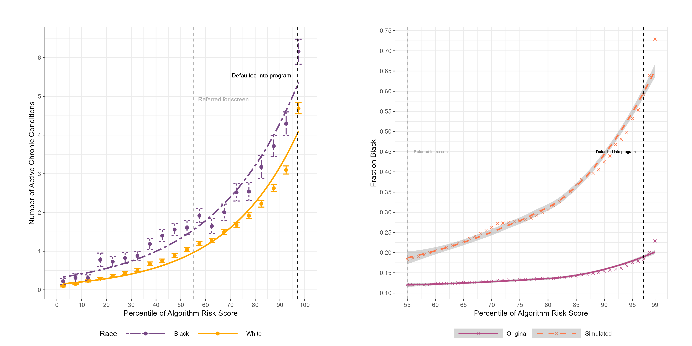
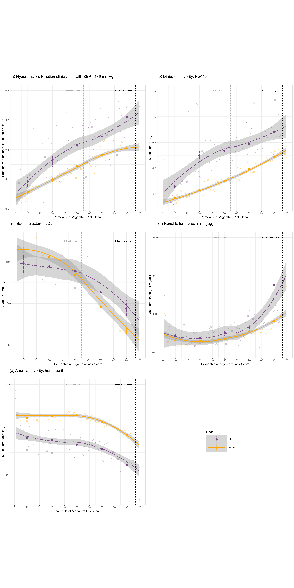
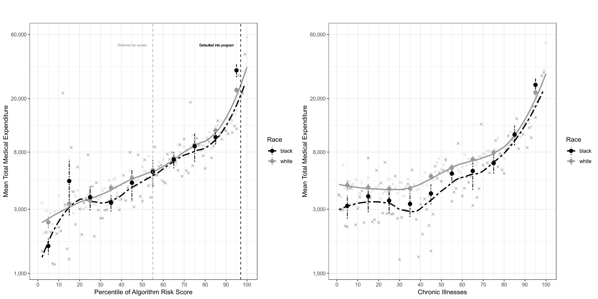

# Results

## Table 1
| Descriptive stats                        | White      | Black     |
|------------------------------------------|------------|-----------|
| n (patient-years)                        | 43,202.0   | 5,582.0   |
| **Demographics**                         | ---        | ---       |
| Age 18-24                                | 0.04       | 0.04      |
| Age 25-34                                | 0.11       | 0.11      |
| Age 35-44                                | 0.19       | 0.20      |
| Age 45-54                                | 0.24       | 0.25      |
| Age 55-64                                | 0.20       | 0.18      |
| Age 65-74                                | 0.14       | 0.14      |
| Age 75+                                  | 0.07       | 0.07      |
| Female                                   | 0.63       | 0.66      |
| **Care management program**              | ---        | ---       |
| Algorithm score (percentile)             | 50         | 50        |
| Race composition of program (%)          | 88.6       | 11.4      |
| **Care utilization**                     | ---        | ---       |
| Actual cost                              | $7,456     | $9,238    |
| Mean biomarkers                          | ---        | ---       |
| HbA1c                                    | 5.9        | 6.4       |
| Systolic BP                              | 126.8      | 131.3     |
| Creatinine                               | 0.9        | 1.2       |
| Hematocrit                               | 40.8       | 37.6      |
| LDL                                      | 103.7      | 104.4     |
| **Active chronic illnesses (comorbidities)** | ---        | ---       |
| Total number of active illnesses         | 1.26       | 2.06      |
| Hypertension                             | 0.32       | 0.46      |
| Diabetes, uncomplicated                  | 0.08       | 0.25      |
| Arrythmia                                | 0.09       | 0.10      |
| Hypothyroid                              | 0.10       | 0.06      |
| Obesity                                  | 0.08       | 0.19      |
| Pulmonary disease                        | 0.10       | 0.14      |
| Cancer                                   | 0.09       | 0.10      |
| Depression                               | 0.06       | 0.09      |
| Anemia                                   | 0.06       | 0.11      |
| Arthritis                                | 0.04       | 0.07      |
| Renal failure                            | 0.03       | 0.08      |
| Electrolyte disorder                     | 0.03       | 0.06      |
| Heart failure                            | 0.03       | 0.05      |
| Psychosis                                | 0.03       | 0.05      |
| Valvular disease                         | 0.03       | 0.04      |
| Stroke                                   | 0.00       | 0.01      |
| Peripheral vascular disease              | 0.02       | 0.04      |
| Diabetes, complicated                    | 0.01       | 0.08      |
| Heart attack                             | 0.02       | 0.03      |
| Liver disease                            | 0.01       | 0.02      |

## Figure 1

## Figure 2

## Figure 3

## Table 2
| predictor                 | Total costs          | Total costs SE        | Avoidable costs     | Avoidable costs SE    | Active chronic conditions | Active chronic conditions SE | Race black          | Race black SE        |
|---------------------------|----------------------|-----------------------|---------------------|-----------------------|---------------------------|------------------------------|---------------------|----------------------|
| Total costs               | 0.166   | 0.003  | 0.234  | 0.003  | 0.121       | 0.003        | 0.193 | 0.003  |
| Avoidable costs           | 0.157  | 0.003 | 0.267  | 0.003  | 0.152        | 0.003        | 0.259 | 0.003  |
| Active chronic conditions | 0.143  | 0.003  | 0.245   | 0.003 | 0.165       | 0.003        | 0.284  | 0.004 |
| Best-worst difference     | 0.023 |         | 0.034 |                       | 0.044       |          | 0.0913 |       |

## Table 3
| population                                | frac_black | frac_black_se | frac_cost | frac_cost_se | frac_health | frac_health_se |
|-------------------------------------------|------------|---------------|-----------|--------------|-------------|----------------|
| Observed program enrollment               | 0.224      | 0.003         | 0.041     | 0.002        | 0.033       | 0.001          |
|  Random, in predicted cost bin            | 0.177      | 0.003         | 0.028     | 0.001        | 0.023       | 0.001          |
|  Predicted health, in predicted-cost bin  | 0.308      | 0.004         | 0.042     | 0.002        | 0.052       | 0.002          |
| Highest predicted cost                    | 0.218      | 0.003         | 0.077     | 0.002        | 0.041       | 0.002          |
| Worst predicted health                    | 0.367      | 0.004         | 0.06      | 0.002        | 0.061       | 0.002          |
